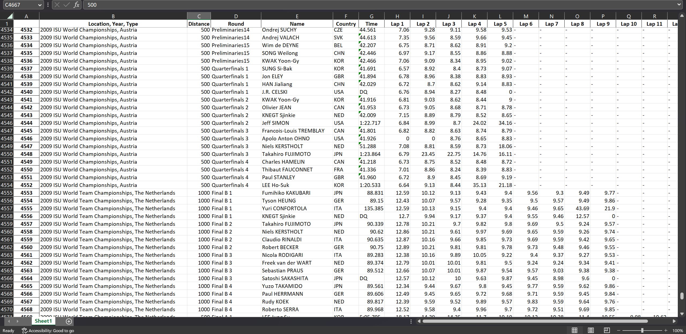

# ISU Scraper
> Webscraper using selenium, BeautifulSoup, requests, and pandas.  Takes results from every international-level speed skating competition and returns skaters times for each race, as well as their times for each lap during that race.  Outputs results to an Excel file.

## Table of Contents
* [General Info](#general-information)
* [Technologies Used](#technologies-used)
* [Features](#features)
* [Setup](#setup)
* [Usage](#usage)
* [Room for Improvement](#room-for-improvement)
* [Acknowledgements](#acknowledgements)
* [Contact](#contact)
<!-- * [License](#license) -->


## General Information
ISU website has the results for every single race skated internationally, as well as the lap times (the time it takes a skater to skate a lap) for each skater's race.  However, the information is spread across multiple different pages and links.  The scraper takes all this information as well as the location of the race and the round it was skated in (Heat, Semifinal, Final, etc.) and exports it to an Excel file.  This program can help skaters easily analyze the trends and optimize training for themselves.  


## Technologies Used
- `python3 --version`: 3.10.12


## Features
- Includes location, year of competition, as well as round, so people can easily find the source on the website.
- Exports all data to an Excel file formatted properly



## Setup
```
pip install -r requirements.txt
```

## Usage
A usage case is provided below

Follow the prompts provided by program.  
'**>**' Denotes user input  
Enter the season you would like to look at:   
\> **2020-2021** *enter the season in this format: year1-year2 where year2 = year1 + 1*  

Which gender would you like the results for? (Type '1' for Men or '2' for Women)  
\> **2**   

The results are about to be saved in a file, please name the file:  
\> **Women's 2021-2022 Results**  

And a file should be downloaded called *Women's 2021-2022 Results.xlsx* where you can find the results.  


## Room for Improvement
Allow program to retake user input if the input does not meet the guidelines.  
Improve efficiency. 

## Acknowledgements
This project was inspired by AJL's Spreadsheets.

## Contact
Helios He: h22he@uwaterloo.ca  
